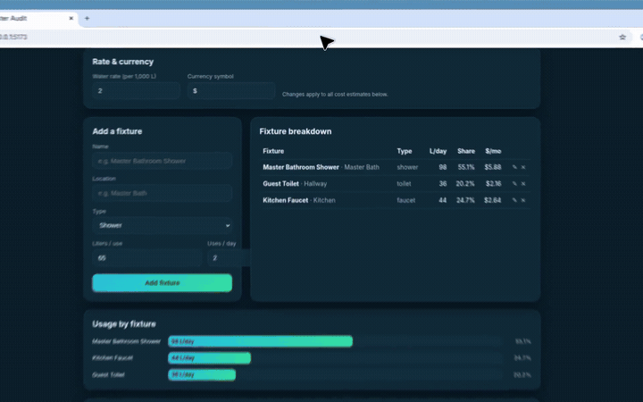

<div align="center">

# GridOS-Logic v2.0

### Dronephy3020

**Autonomous perch routing for power-line inspection drones**

Drones that land on live conductors to recharge — with physics safety, weather lockout, human override, memory, and predictive maintenance in one command dashboard.

[](#quick-start)
[](#quick-start)
[](#quick-start)
[](#watch-the-demo)

</div>

---

## Watch the demo

This walkthrough **plays on this page** — it does not download a file.

<p align="center">
  
</p>

The clip is the live React dashboard talking to the FastAPI physics stack — not a mockup.

| Time in clip | What you are seeing | Why it matters |
| --- | --- | --- |
| Header metrics | Drones, thermal safety, induction µT, maintenance watch | The fleet state is one glance, not a log dump |
| Vector grid | Colored spans (SEG-A1, B3, C5, D9) + drone marker | Green = safe to perch; color is a safety state, not decoration |
| Weather override | Heavy precip + Apply | Grid goes **red**, next perch becomes `NO_SAFE_SEGMENT` |
| Human command | Operator authority panel | A person can ground the fleet or force a span |
| Successful perch | Memory feedback button | The drone learns which spans actually charged well |
| Anomaly forecast | WATCH on SEG-C5 harmonics | Routing will avoid degrading assets unless a human forces them |

---

## In plain English

Inspection drones that *perch on energized lines* have a brutal constraint: the span that looks closest might be thermally unsafe, magnetically weak, or about to fail from harmonics.

GridOS answers one operational question:

> Given this drone’s battery, this weather, and this grid, **which span is safe to land on next — and why?**

The answer is not a single score. It is a pipeline:

```text
Telemetry  →  Physics (heat, induction, corona)
           →  Weather lockout
           →  Battery-safe range
           →  Memory of past perches
           →  Predictive maintenance penalty
           →  Human override (always wins)
           →  Next perch + written rationale
```

If wind or rain is over the limit, **autonomy stops**. That is visible in the demo: four green spans become four red spans in one click.

---

## What the stack implements

| Layer | Where | What it does |
| --- | --- | --- |
| Physics | `app/physics_engine.py` | IEEE 738-style heating, Biot-Savart induction at 0.05 m, harmonic clamp angle, corona guardrail |
| Weather | `app/weather_service.py` | Lockout if wind > 15 m/s or heavy precipitation; quadrant overrides |
| Routing | `app/routing_engine.py` | Haversine + battery filter. `score = (B / (distance + 0.1)) × memory` |
| Human | `app/human_control.py` | Emergency grounding; force-segment with safety checks |
| Memory | `app/memory_engine.py` | Per-drone success ratio + charge-rate EMA |
| Maintenance | `app/maintenance_engine.py` | Battery-drain and span-wear scoring; CRITICAL spans skipped unless forced |
| Dashboard | `src/components/Dashboard.jsx` | Live vector map, controls, anomaly list |

---

## Repository map

```text
dronephy3020/
├── app/                         FastAPI backend
│   ├── main.py                  routing, grid, weather, control, memory, maintenance
│   ├── physics_engine.py
│   ├── routing_engine.py
│   ├── weather_service.py
│   ├── human_control.py
│   ├── memory_engine.py
│   └── maintenance_engine.py
├── src/
│   ├── components/Dashboard.jsx Command UI in the video
│   ├── AppView.jsx
│   └── styles.css
├── docs/
│   ├── demo.mp4
│   └── demo-poster.jpg
├── test_backend.py
├── requirements.txt
├── package.json
└── run.sh                       tests → API :8000 → UI :3000
```

---

## Quick start

```bash
python -m pip install -r requirements.txt
npm install
./run.sh
```

| Surface | URL |
| --- | --- |
| Dashboard (the demo) | http://localhost:3000 |
| API | http://localhost:8000 |
| OpenAPI | http://localhost:8000/docs |

---

## Why these controls exist

Industry fleets keep losing aircraft to the same five failure modes. GridOS maps each one to a concrete layer:

| Industry pain | What this repo does |
| --- | --- |
| Weather volatility (delivery / inspection) | Async weather + hard lockout + operator overwrite |
| BVLOS / audit pressure | Human command layer + rationale string on every perch |
| Battery and charging uncertainty | Range filter + induction score + memory of real charge rates |
| Landing on harmonic / hot conductors | Thermal, corona, and clamp-angle checks |
| Silent wear (battery fade, clamp life) | Predictive scores that pull CRITICAL assets out of autonomy |

---

## API usage

Next perch:

```bash
curl -s http://localhost:8000/api/v1/routing/next-perch \
  -H 'Content-Type: application/json' \
  -d '{
    "drone_id": "DRONE-001",
    "latitude": 37.7712,
    "longitude": -122.4444,
    "battery_percentage": 76.0,
    "consumption_rate_per_min": 1.1
  }'
```

Teach memory + maintenance from a real landing:

```bash
curl -s http://localhost:8000/api/v1/memory/feedback \
  -H 'Content-Type: application/json' \
  -d '{
    "drone_id": "DRONE-001",
    "segment_id": "SEG-B3",
    "successful_perch": true,
    "observed_charge_rate_pct_per_hr": 28.5
  }'
```

```bash
curl -s http://localhost:8000/api/v1/maintenance/report
```

Human override:

```bash
curl -s http://localhost:8000/api/v1/control/command \
  -H 'Content-Type: application/json' \
  -d '{
    "operator_id": "ops-01",
    "force_segment_id": "SEG-B3",
    "emergency_lockout": false,
    "reason": "Prefer low-risk maintenance corridor"
  }'
```

---

<p align="center"><sub>GridOS-Logic · perch only when physics, weather, memory, and a human all allow it</sub></p>
